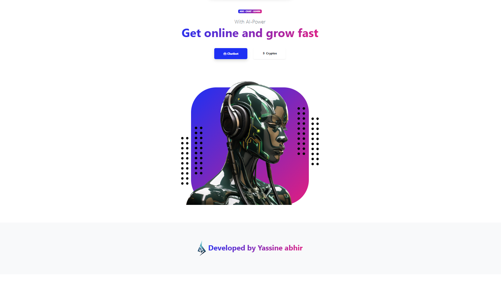
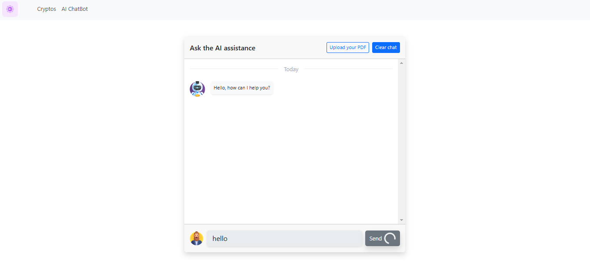
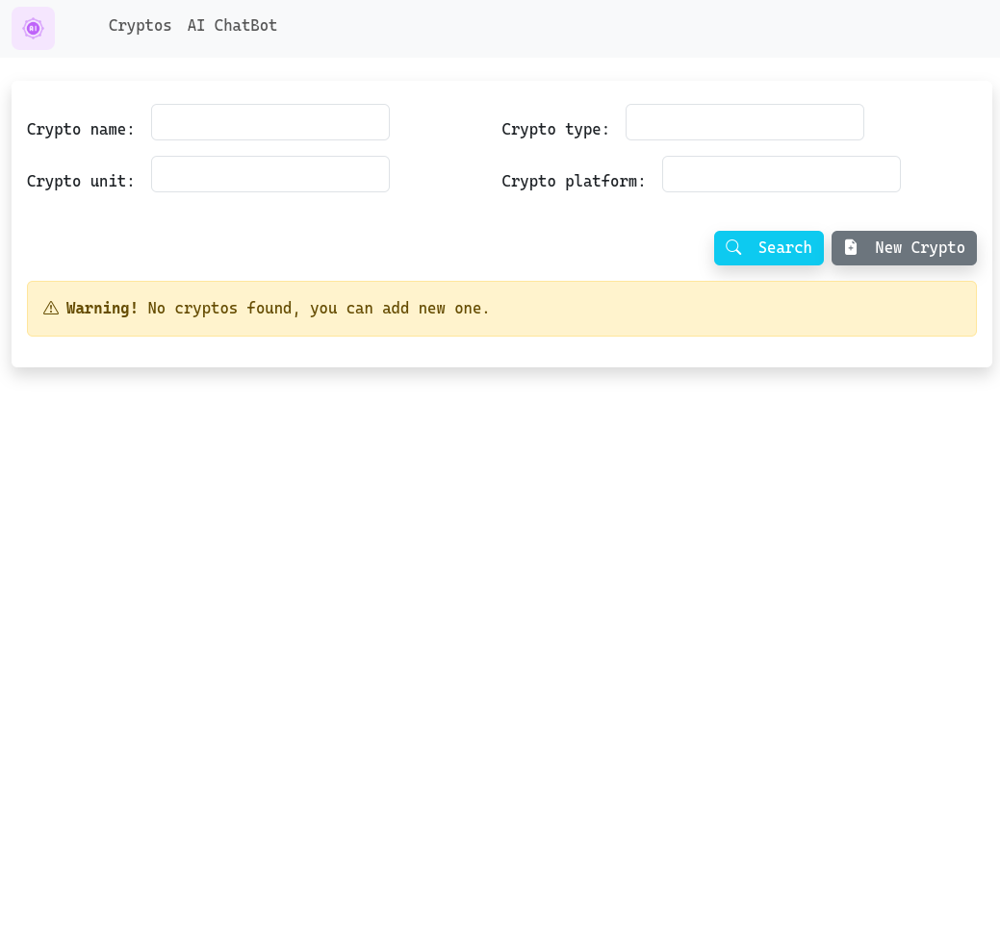
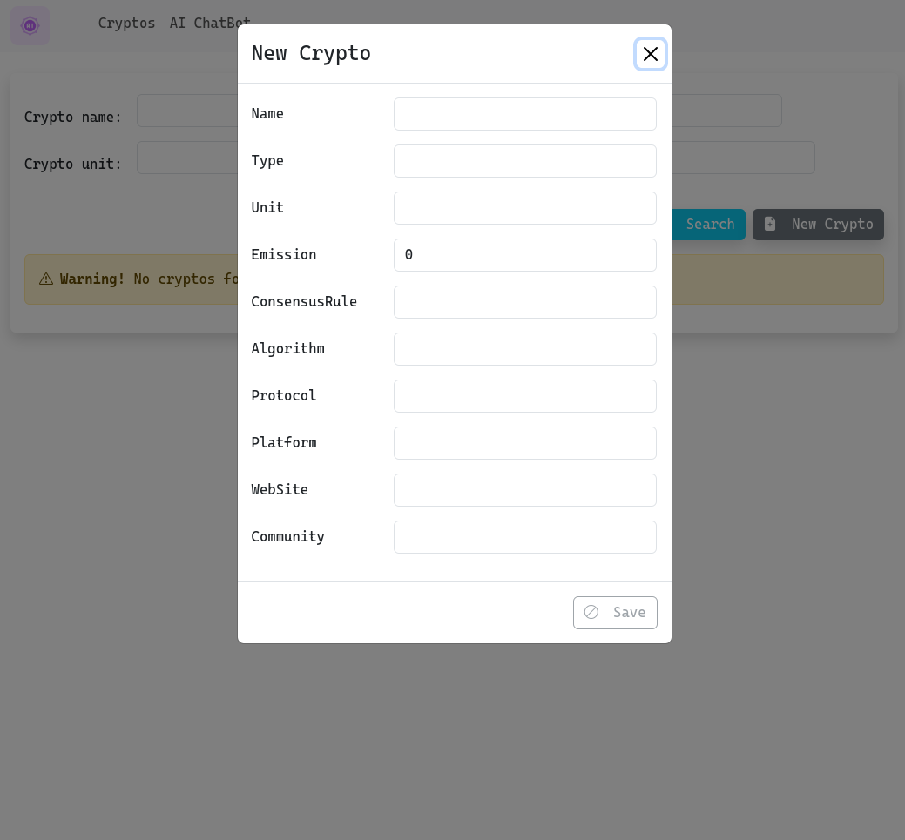

# Architecture Microservices avec Spring Boot et Angular

## 🚀 Présentation du projet

Ce projet met en œuvre une **architecture microservices** pour un backend développé avec **Spring Boot**, intégrée à Docker et Docker Compose. L'application complète est enrichie d'une interface frontend moderne en **Angular 19**.

---

## 🏗️ Architecture

### Microservices :

1. **Service Gateway**

   - **Port** : `8888`
   - Route les requêtes API vers les microservices concernés.

2. **Service Discovery**

   - **Port** : `8761`
   - Utilise le serveur **Eureka** pour l'enregistrement et la découverte dynamique des microservices.

3. **Service Config**

   - **Port** : `9999`
   - Gestion centralisée des configurations via le dépôt :  
     [tp4_config_repo](https://github.com/YASSINE-ABHIR/ap4-docker-spring-angular-microservices-config_repo).

4. **Service RAG** (Chatbot)

   - **Port** : `8080`
   - Traitement des requêtes chatbot et chargement de PDF.
   - Endpoints :
     - `/chat` (POST) : Traitement des messages du chatbot.
     - `/load-pdf` (POST) : Chargement et traitement des fichiers PDF.

5. **Service Crypto**

   - **Port** : `8081`
   - Gestion CRUD des données liées aux cryptomonnaies.

6. **Frontend Angular**
   - **Technologie** : Angular 19
   - **Port** : `4200`
   - Interface utilisateur pour interagir avec les microservices.

---

## 📸 Captures d'écran

### Page d'accueil



### Interface Chatbot



### Chargement PDF


### Tableau des cryptomonnaies



### Ajouter une nouvelle cryptomonnaie



---

## 📦 Infrastructure

### Docker et Docker Compose

- Chaque microservice possède un `Dockerfile` dédié.
- **Volumes** :

  - `chatbot_data` : Données du chatbot.
  - `crypto_data` : Données des cryptomonnaies.

- **Réseaux** :
  - `tp4-network` : Communication isolée entre les services.

#### Exemple de configuration Docker Compose :

```yaml
volumes:
  chatbot_data:
    driver: local
  crypto_data:
    driver: local

networks:
  tp4-network:
    driver: bridge

services:
  pgvector:
    container_name: pgdb-store
    image: "pgvector/pgvector:pg16"
    env_file:
      - ./.env
    volumes:
      - chatbot_data:/var/lib/postgresql/data
    ports:
      - "5432:5432"
    networks:
      - tp4-network
```

---

## 🔑 Variables d'environnement

Variables à configurer dans le fichier `.env` :

- `POSTGRES_DB`
- `POSTGRES_PASSWORD`
- `POSTGRES_USER`
- `POSTGRES_JDBC`
- `CONFIG_SERVICE_URL`
- `DISCOVERY_SERVICE_URL`
- `DISCOVERY_BASE_URL`
- `GATEWAY_SERVICE_URL`
- `OPEN_AI_API_KEY`

---

## ⚙️ Installation et Configuration

### Prérequis

- Docker et Docker Compose
- Java 17 ou supérieur
- Node.js et Angular CLI

### Étapes

1. Cloner les services backend et frontend depuis GitHub :

   ```bash
   git clone https://github.com/YASSINE-ABHIR/ap4-docker-springBoot-angular-microservices
   ```

2. Accéder aux répertoires des services et construire les fichiers JAR :

   ```bash
   cd gateway-service
   mvn clean package -DskipTests
   ```

3. Définir les variables d'environnement dans un fichier `.env`.

4. Lancer les services avec Docker Compose :

   ```bash
   docker-compose up -d --build
   ```

5. Accéder au frontend via : `http://localhost`.

---

## 🛠️ Fonctionnalités clés

- **Découverte dynamique des services** avec Eureka.
- **Gestion centralisée des configurations**.
- **Chatbot** pour traiter les requêtes en langage naturel.
- **Chargement et analyse de fichiers PDF**.
- **Gestion CRUD des cryptomonnaies**.
- Architecture complète avec **Angular 19** et **Spring Boot**.
- Orchestration simplifiée avec **Docker Compose**.

---

## 🌐 Endpoints API

### Gateway Service : `http://localhost:8888`

- Redirection vers les différents services backend.

### Service RAG : `http://localhost:8080`

- `/chat` : Traitement des requêtes chatbot.
- `/load-pdf` : Chargement de fichiers PDF.

### Service Crypto : `http://localhost:8081`

- Endpoints CRUD complets pour la gestion des cryptomonnaies.

---

## 📄 Licence

Ce projet est sous licence [MIT](LICENSE).

---

## 🤝 Contribution

Les contributions sont les bienvenues ! Voici les étapes à suivre :

1. Forker le dépôt.
2. Créer une branche :
   ```bash
   git checkout -b feature/votre-fonctionnalite
   ```
3. Commettre vos modifications :
   ```bash
   git commit -m "Votre message explicatif"
   ```
4. Pousser la branche :
   ```bash
   git push origin feature/votre-fonctionnalite
   ```
5. Créer une pull request.

---

## 🛡️ Sécurité

- Veillez à configurer les données sensibles (API keys, identifiants) dans le fichier `.env`.
- Mettez à jour régulièrement les dépendances et les images Docker pour assurer la sécurité.

---

## 🙌 Remerciements

Merci à tous les contributeurs et à la communauté open-source.
