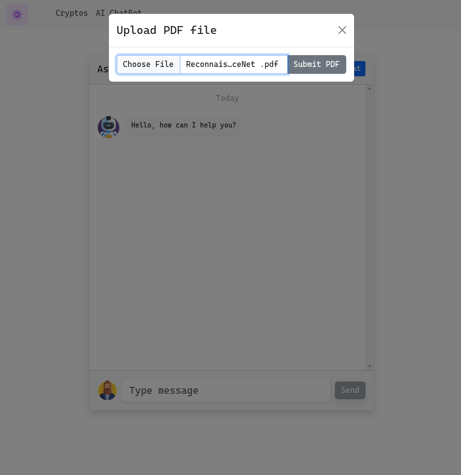

# Microservice Architecture with Spring Boot

## 🚀 Project Overview

This project implements a **microservice architecture** for a backend system using **Spring Boot**. It consists of multiple services, each with a dedicated responsibility, integrated with Docker and Docker Compose. The frontend is developed with **Angular 19**, creating a complete full-stack application.

---

## 🏗️ Architecture

### Microservices:

1. **Gateway Service**
   - **Port**: `8888`
   - Acts as the API gateway for routing requests to appropriate microservices.
2. **Discovery Service**

   - **Port**: `8761`
   - Uses **Eureka Discovery Server** to register and discover microservices dynamically.

3. **Config Service**

   - **Port**: `9999`
   - Centralized configuration management using repository:  
     [tp4_config_repo](https://github.com/YASSINE-ABHIR/ap4-docker-spring-angular-microservices-config_repo).

4. **RAG Service**

   - **Port**: `8080`
   - Handles chatbot processing and PDF loading.
   - Endpoints:
     - `/chat` (POST): Processes a chatbot query.
     - `/load-pdf` (POST): Accepts a PDF file for processing.

5. **Crypto Service**

   - **Port**: `8081`
   - CRUD operations for managing cryptocurrency information.

6. **Frontend Service**
   - **Technology**: Angular 19
   - **Port**: `4200`
   - Provides a user interface for interacting with the backend system.

---

## 📸 Screenshots

### Landing Page


### Chatbot Interface


### Upload PDF Interface



### Cryptocurrency Table


### Add New Cryptocurrency


---

## 📦 Infrastructure

### Docker and Docker Compose

- Each service includes a dedicated `Dockerfile` for containerization.
- **Volumes**:
  - `chatbot_data`: Stores chatbot-related data.
  - `crypto_data`: Stores cryptocurrency-related data.
- **Networks**:
  - `tp4-network`: Ensures isolated communication between services.

#### Example Docker Compose Configuration:

```yaml
volumes:
  chatbot_data:
    driver: local
  crypto_data:
    driver: local

networks:
  tp4-network:
    driver: bridge

services:
  pgvector:
    container_name: pgdb-store
    image: "pgvector/pgvector:pg16"
    env_file:
      - ./.env
    volumes:
      - chatbot_data:/var/lib/postgresql/data
    ports:
      - "5432:5432"
    networks:
      - tp4-network
```

---

## 🔑 Environment Variables

The following environment variables are used in `.env`:

- `POSTGRES_DB`
- `POSTGRES_PASSWORD`
- `POSTGRES_USER`
- `POSTGRES_JDBC`
- `CONFIG_SERVICE_URL`
- `DISCOVERY_SERVICE_URL`
- `DISCOVERY_BASE_URL`
- `GATEWAY_SERVICE_URL`
- `OPEN_AI_API_KEY`

---

## ⚙️ Setup and Installation

### Prerequisites

- Docker and Docker Compose
- Java 17+
- Node.js and Angular CLI

### Steps

1. Clone the repositories for backend services and the frontend:
   ```bash
   $ git clone https://github.com/YASSINE-ABHIR/ap4-docker-spring-angular-microservices
   ```
2. Navigate to each service directory and build JAR files:
   ```bash
   $ cd gateway-service
   $ mvn clean package -DskipTests
   ```
3. Set up environment variables in a `.env` file.
4. Start services with Docker Compose:
   ```bash
   $ docker-compose up -d --build
   ```
5. Access the frontend at `http://localhost`.

---

## 🛠️ Key Features

- **Dynamic Service Discovery** with Eureka.
- **Centralized Configuration Management**.
- **Chatbot Processing** for natural language queries.
- **PDF File Upload and Parsing**.
- **Cryptocurrency Management** with CRUD operations.
- Full-stack architecture using **Angular 19** and **Spring Boot**.
- Seamless container orchestration with **Docker Compose**.

---

## 🌐 API Endpoints

### Gateway Service: `http://localhost:8888`

- Routes to backend services.

### RAG Service: `http://localhost:8080`

- `/chat`: Process chatbot queries.
- `/load-pdf`: Accept PDF files.

### Crypto Service: `http://localhost:8081`

- Full CRUD endpoints for cryptocurrency management.

---

## 📄 License

This project is licensed under the [MIT License](LICENSE).

---

## 🤝 Contribution

Contributions are welcome! Please follow these steps:

1. Fork the repository.
2. Create a feature branch:
   ```bash
   git checkout -b feature/your-feature
   ```
3. Commit your changes:
   ```bash
   git commit -m "Add your message here"
   ```
4. Push to the branch:
   ```bash
   git push origin feature/your-feature
   ```
5. Submit a pull request.

---

## 🛡️ Security

- Ensure to configure sensitive data (API keys, database credentials) in `.env` files.
- Regularly update dependencies and Docker images for security patches.

---

## 🙌 Acknowledgements

Special thanks to all contributors and the open-source community.

---

```

Let me know if you need adjustments or additional sections!
```
